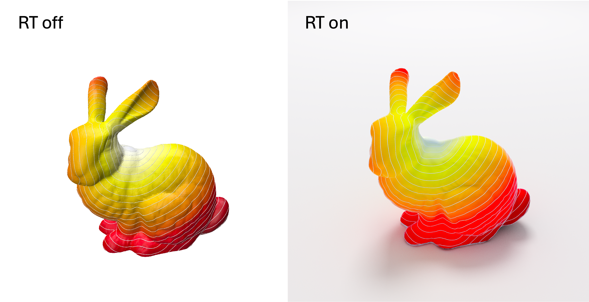

# polyscope_rt



A realistic path-tracing extension for [Polyscope](https://polyscope.run/) designed around a single design constraint: **the migration from standard Polyscope to path-traced rendering should cost exactly one line of code.**

> **Platform status** — currently Apple Silicon only: shaders are compiled with Metal 4.0 (macOS 26+), which requires Apple Silicon. MetalFX denoising is included. A cross-platform Vulkan backend is planned.

---

## The One-Line Migration

A typical Polyscope application aliases the namespace for convenience:

```cpp
namespace ps = polyscope;        // standard Polyscope
```

Switching to path tracing requires changing that alias and linking against `polyscope_rt::plugin`:

```cpp
namespace ps = polyscope::rt;    // path-traced Polyscope
```

Every call site — `ps::init()`, `ps::registerSurfaceMesh(...)`, `ps::show()` — remains identical. The extension intercepts the scene, builds a ray tracing acceleration structure, and replaces the rasterized viewport with a progressive path tracer.

### Example

```cpp
#include "geometrycentral/surface/meshio.h"
#include "geometrycentral/surface/heat_method_distance.h"
#include "geometrycentral/surface/marching_triangles.h"

#include "polyscope/rt/polyscope.h"      // polyscope/polyscope.h
#include "polyscope/rt/surface_mesh.h"   // polyscope/surface_mesh.h
#include "polyscope/rt/curve_network.h"  // polyscope/curve_network.h

namespace gc  = geometrycentral;
namespace gcs = geometrycentral::surface;
namespace ps  = polyscope::rt;           // ← the only change from standard Polyscope

int main(int argc, char** argv) {
  auto [mesh, geometry] = gcs::readSurfaceMesh(argv[1]);

  // ... compute geodesic distance and iso-contours with geometry-central ...

  ps::init();

  auto* psMesh = ps::registerSurfaceMesh("bunny",
      geometry->inputVertexPositions, mesh->getFaceVertexList());
  psMesh->addVertexScalarQuantity("geodesic distance", distValues)
        ->setColorMap("viridis")->setEnabled(true);

  auto* psCurve = ps::registerCurveNetwork("iso-contours", isoNodes, isoEdges);
  psCurve->setColor({0.f, 0.f, 0.f});
  psCurve->setRadius(0.001f, false);

  ps::show();
}
```

---

## Features

### Rendering

- Progressive path tracing with accumulation and per-frame SPP budget
- GGX microfacet BRDF with metallic/roughness/transmission/IOR
- Directional, point, spot, and area lights via a simple API
- MetalFX denoising (Apple Silicon) for interactive preview
- Standard and [Toon shading](https://github.com/nvpro-samples/vk_toon_shader) modes (with customizable contour detection)
- Ground plane with configurable reflectance
- Tone mapping (exposure, gamma, saturation)

### Material system

Per-mesh PBR overrides with a built-in preset library:

```cpp
polyscope::rt::applyMaterial("bunny", polyscope::rt::Gold());
polyscope::rt::setMaterial("floor", /*metallic=*/0.0f, /*roughness=*/0.8f);
polyscope::rt::setTransmission("sphere", 1.0f, /*ior=*/1.5f);
```

Available presets: `Gold`, `Silver`, `Copper`, `Aluminum`, `Chrome`, `Mirror`, `Glass`, `FrostedGlass`, `Diamond`, `Water`, `Plastic`, `Rubber`, `Ceramic`, `Wood`, `Marble`, `Emissive`, `Unlit`, and more.

### Lighting API

```cpp
polyscope::rt::setMainLight({-0.5f, -1.f, 0.7f}, {1,1,1}, 3.0f);
polyscope::rt::setEnvironment({1,1,1}, 0.3f);

size_t h = polyscope::rt::addPointLight({0,2,0}, {1,0.8,0.6}, 5.0f);
polyscope::rt::removeLight(h);
```

### Camera

The in-viewer Camera panel exposes Eye / Center / Up / FoV fields that live-track the viewport and apply changes immediately. Presets can be saved and loaded from `camera_preset.txt`.

### Export

The Screenshot panel renders a high-SPP image offline and saves it as PNG or JPG, with an optional transparent-background mode.

---

## Building

### 1. Metal toolchain

The build compiles Metal shaders with `xcrun -sdk macosx metal`. This requires either
**Xcode** (full IDE) or **Xcode Command Line Tools** to be installed and active.

Check whether the toolchain is present:

```bash
xcrun -sdk macosx --find metal
# expected output: /path/to/...metal
```

If the command fails, install the tools:

```bash
# Option A — full Xcode (recommended, includes MetalFX headers)
# Install from https://developer.apple.com/xcode/ or the Mac App Store

# Option B — command line tools only (no MetalFX denoising)
xcode-select --install
```

If you have multiple Xcode versions, make sure the active one is selected:

```bash
sudo xcode-select -s /Applications/Xcode.app/Contents/Developer
xcrun -sdk macosx --find metal   # verify
```

### 2. Clone and build

```bash
git clone --recurse-submodules https://github.com/chengkai-dai/polyscope_rt.git
cd polyscope_rt

cmake -S . -B build -DCMAKE_BUILD_TYPE=Release
cmake --build build -j8
```

If you already cloned without `--recurse-submodules`:

```bash
git submodule update --init --recursive
```

Run the geometry-central example:

```bash
./build/bin/geometry_central_rt_example /path/to/mesh.obj
```

Run the surface mesh example:

```bash
./build/bin/polyscope_rt_surface_mesh_example /path/to/mesh.obj
```

---

## TODO

### Structure support

- [ ] Wireframe rendering — direct edge rendering without triangle fill
- [ ] Native point rendering — per-point radius and color quantity support
- [ ] Vector field rendering — arrow/tube primitives from Polyscope face/vertex vector quantities

### Rendering

- [ ] Texture maps — UV-mapped albedo and normal textures on `SurfaceMesh`
- [ ] Depth of field — thin-lens camera with aperture and focus distance

### Platform

- [ ] Vulkan backend — Linux, Windows with NVIDIA hardware ray tracing

### Workflow

- [ ] Python bindings — expose the RT API alongside `polyscope`'s Python interface
